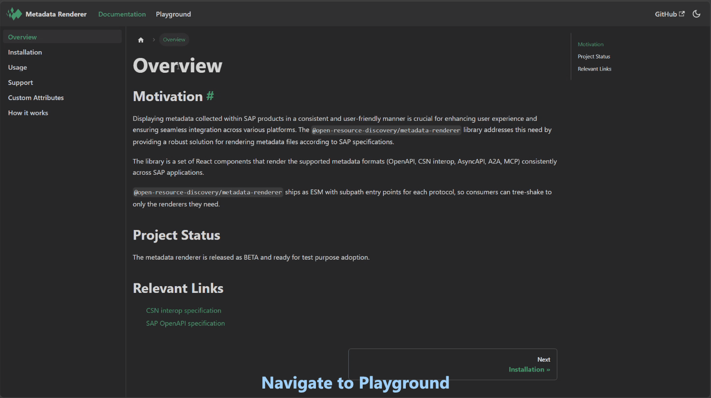

[](https://api.reuse.software/info/github.com/open-resource-discovery/metadata-renderer) [](https://github.com/open-resource-discovery/metadata-renderer/actions/workflows/main.yml) [](https://www.npmjs.com/package/@open-resource-discovery/metadata-renderer)

# Metadata Renderer

React components that render metadata documents of various types consistently.

📖 **Full documentation:** <https://open-resource-discovery.github.io/metadata-renderer/>

👉 **LIVE DEMO** https://open-resource-discovery.github.io/metadata-renderer/playground



## Supported formats

- [OpenAPI](https://www.openapis.org/) 2.0, 3.0 / 3.1+ (JSON or YAML) — via [Scalar](https://scalar.com/)
- [CSN Interop](https://sap.github.io/csn-interop-specification/) — via [csn-interop-renderer](https://sap.github.io/csn-interop-renderer/)
- [AsyncAPI](https://asyncapi.com/) 2.x / 3.x (JSON or YAML) — via [@asyncapi/react-component](https://github.com/asyncapi/asyncapi-react)
- [A2A Agent Cards](https://a2a-protocol.org/latest/specification/) — via [@open-resource-discovery/a2a-editor](https://www.npmjs.com/package/@open-resource-discovery/a2a-editor)
- [MCP Server Cards](https://github.com/modelcontextprotocol/modelcontextprotocol/pull/2127) — via [@open-resource-discovery/mcp-server-card-ui](https://www.npmjs.com/package/@open-resource-discovery/mcp-server-card-ui)

More formats will be added over time. See the [Support](https://open-resource-discovery.github.io/metadata-renderer/docs/Supported) page for the current list.

## Install

Requires Node.js ≥ 22, npm ≥ 10, and React 18 or 19.

```bash
npm install @open-resource-discovery/metadata-renderer
```

## Usage

The default `MetadataRenderer` auto-detects the format from the input string and dispatches to the appropriate renderer.

```tsx
import { MetadataRenderer } from '@open-resource-discovery/metadata-renderer';
import '@open-resource-discovery/metadata-renderer/styles';

export function MyView({ file }: { file: string }) {
    return <MetadataRenderer content={file} />;
}
```

The `styles` import is side-effecting and must appear once in your application entry file.

### Protocol-specific renderers

If you already know the format, import only the renderer you need — the rest stays out of your bundle:

```tsx
import { OpenApiRenderer } from '@open-resource-discovery/metadata-renderer/openapi';
import { CsnRenderer } from '@open-resource-discovery/metadata-renderer/csn';
import { AsyncApiRenderer } from '@open-resource-discovery/metadata-renderer/asyncapi';
import { A2ARenderer } from '@open-resource-discovery/metadata-renderer/a2a';
import { McpRenderer } from '@open-resource-discovery/metadata-renderer/mcp';
```

### Theming

Pass a `theme` prop to override the default color tokens. Use the `createTheme` helper for a type-safe camelCase API:

```tsx
import { MetadataRenderer, createTheme } from '@open-resource-discovery/metadata-renderer';

const theme = createTheme({
    primary: '#0098ff',
    background: '#1e1e1e',
    foreground: '#d4d4d4',
});

<MetadataRenderer content={file} className="dark" theme={theme} />;
```

See the [Usage guide](https://open-resource-discovery.github.io/metadata-renderer/docs/Usage) for the full prop reference and theming tokens.

> **Maintainers:** to change how each renderer is styled internally (native library output and this project's custom components), see [STYLING.md](STYLING.md).

## Development

```bash
npm run dev              # Vite dev server (demo app)
npm run build            # Build library to dist/
npm test                 # Run unit tests
npm run typecheck        # TypeScript check
npm run website:start    # Start the Docusaurus docs site locally
```

## Contributing

Please see [CONTRIBUTING.md](CONTRIBUTING.md) for details on how to contribute to this project.

## License

Please see our [LICENSE](LICENSE) for copyright and license information. Detailed information including third-party components and their licensing/copyright information is available [via the REUSE tool](https://api.reuse.software/info/github.com/open-resource-discovery/metadata-renderer).
